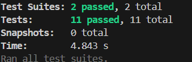

# Metro API 🚇

[](https://www.docker.com/)
[]()
[]()
[](http://localhost:8080)

API pour récupérer les horaires du métro (prochain passage et dernier passage) avec PostgreSQL comme backend.  

---

## 1. Installation

Clone le repo et installe les dépendances :

```bash
git clone <ton-repo>
cd apiexpress
npm install
```

Crée un fichier `.env` à la racine :

```env
PORT=5000
HEADWAY_MIN=4
LAST_WINDOW_START=00:50
SERVICE_END=01:25
SERVICE_START=05:35

POSTGRES_USER=user
POSTGRES_PASSWORD=password
POSTGRES_DB=myapp
POSTGRES_HOST=db
POSTGRES_PORT=5432
```

---

## 2. Docker (DB + API + Swagger)

Lancer tous les services :

```bash
docker-compose up -d --build
```

- API → [http://localhost:5000](http://localhost:5000)  
- Swagger UI → [http://localhost:8080](http://localhost:8080)

---

## 3. Endpoints

### `/last-metro`

```http
GET /last-metro?station=Chatelet
```

Réponse exemple :

```json
{
  "station": "Chatelet",
  "lastMetro": "01:25",
  "line": "M1",
  "tz": "Europe/Paris"
}
```

**Capture attendue :**  


---

### `/next-metro`

```http
GET /next-metro?station=Chatelet
```

Réponse exemple :

```json
{
  "station": "Chatelet",
  "line": "M1",
  "nextArrival": "12:34",
  "isLast": false,
  "headwayMin": 4,
  "tz": "Europe/Paris"
}
```

**Capture attendue :**  


---

## 4. Tests

### 4.1 Unit tests

```bash
npm test
```

Sortie attendue :

```
PASS  __tests__/nextArrival.test.js
PASS  __tests__/utils/nextArrival.js
```

**Capture sortie :**  


---

### 4.2 Integration tests (avec DB)

Depuis Docker :

```bash
docker-compose exec api npm test
```

Sortie attendue :

```
PASS  __tests__/integration.test.js
```

**Capture sortie :**  


> Vérifie que `/last-metro` et `/next-metro` retournent bien les données de la DB réelle.

---

## 5. OpenAPI + Swagger

- OpenAPI YAML → `./openapi/openapi.yaml`  
- Swagger UI → [http://localhost:8080](http://localhost:8080)  
- Validation OpenAPI : via [Swagger Editor](https://editor.swagger.io/) ou `swagger-cli validate openapi.yaml`

**Capture Swagger UI :**  


---

## 6. Livrables

| # | Branch | Contenu attendu |
|---|--------|----------------|
| 04 | `feature/db-read` | Capture d’écran `GET /last-metro` et `GET /next-metro` avec DB |
| 05 | `feature/swagger` | OpenAPI valide + Swagger à jour |
| 06 | `feature/unit-tests` | Sortie `npm test` (unitaires) |
| 07 | `feature/integration-tests` | Sortie `npm test` (intégration) avec DB réelle |

---

## 7. Notes

- Tous les horaires sont en **Europe/Paris**  
- Le service est fermé entre `SERVICE_END` et `SERVICE_START`  
- Les tests unitaires ne nécessitent pas de DB, les tests d’intégration utilisent la DB réelle.
